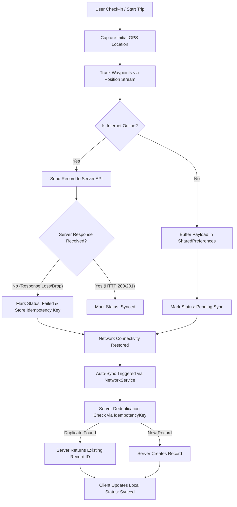
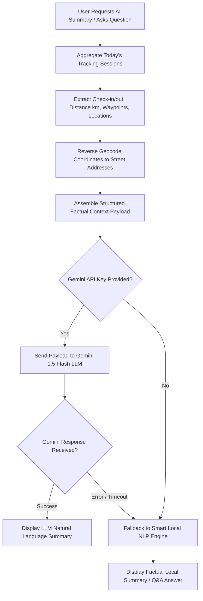

# Flutter Location & Visit Tracking Assessment

## Overview

This Flutter application is an enterprise-grade field tracking and location synchronization assessment project. It implements continuous GPS movement tracking, accurate geodesic distance calculations, offline-first queue persistence with auto-synchronization, server-side idempotency for duplicate prevention, robust zero-fallback API error handling, and a Gemini LLM-powered visit summary with local smart NLP fallback.

---

## Assessment Tasks

* **Task 1 – Location Tracking & Distance**: Captures precise GPS coordinates on check-in/check-out, tracks continuous movement using `geolocator`, applies stationary/accuracy filtering, calculates cumulative geodesic distance on the WGS-84 ellipsoid, and displays distance strictly in kilometres.
* **Task 2 – Missing Location/API Data Handling**: Implements strict validation on external distance payloads. Explicitly enforces the **Zero Fallback Rule**—null, missing, or negative values are presented as unavailable/error states and are **never** replaced with arbitrary hard-coded numbers (e.g. `0.88 km`).
* **Task 3 – Offline Synchronization**: Persists trip records locally in `SharedPreferences` while offline. Automatically triggers queue sync upon network restoration via `connectivity_plus`. Utilizes client-generated unique `idempotencyKey` values to prevent duplicate server record creation when network responses drop mid-flight.
* **Task 4 – AI Visit Summary**: Integrates Google Gemini 1.5 Flash (`google_generative_ai`) to answer natural language visit queries based strictly on factual application metrics. Provides a local smart NLP fallback engine when no API key is supplied.
* **Task 5 – Code Quality & Architecture**: Built using Clean Layered Architecture (`UI` $\rightarrow$ `Provider` $\rightarrow$ `Repository` $\rightarrow$ `Service` $\rightarrow$ `Model`) with strict null-safety, modular components, comprehensive logging (`LoggerService`), and 28 automated unit/integration tests.

---

## Task 1 – Location Tracking & Distance

### Implementation Details
* **Check-in / Start Flow**: `TrackingProvider.checkIn()` verifies location permissions, captures initial coordinate fix (`LocationService.getCurrentLocation()`), creates a `TrackingSession` with initial `startLocation` and `startTime`, and initializes the position stream (`_startPositionStream()`).
* **Movement Tracking**: Subscribes to `Geolocator.getPositionStream()` configured with platform-specific parameters (`AndroidSettings` / `AppleSettings`).
* **Check-out / Stop Flow**: `TrackingProvider.checkOut()` stops the position stream, captures final `endLocation` and `endTime`, calculates final distance increment, persists the trip to local history, and enqueues the record for sync.
* **Distance Calculation**: Uses `Geolocator.distanceBetween()` to calculate incremental geodesic distance in meters between consecutive valid waypoints, accumulating into `totalDistanceMeters`, converted to kilometres via `totalDistanceKm`.
* **Filtering & Accuracy**: Points with accuracy $> 35.0$ meters are ignored. Stationary/duplicate points with displacement $< 3.0$ meters are filtered out. Speed jumps $> 42.0$ m/s (~150 km/h) are rejected as GPS teleportation anomalies.
* **Background Tracking**: Android uses a Foreground Notification Service (`AndroidSettings.foregroundNotificationConfig`) with `enableWakeLock: true`. iOS uses `AppleSettings` with `showBackgroundLocationIndicator: true` and `UIBackgroundModes` set to `location`.
* **Resource Disposal**: `TrackingProvider.dispose()` cancels `StreamSubscription<Position>` and duration timers to prevent memory leaks.

---

## Task 2 – Missing Location/API Data Handling

### Implementation Details
* **Payload Validation**: `DistanceResponse.fromJson()` parses API JSON payloads and checks field existence, nullability, data types, non-NaN/non-infinite constraints, and non-negative bounds ($distance \ge 0.0$).
* **Zero Fallback Rule**: Missing, null, or negative distance values are **never** populated with arbitrary numbers like `0.88 km` or `0.0 km`. `DistanceProvider` explicitly marks state as `DistanceStatus.unavailable`, setting `_distanceKm = null`.
* **Error & Exception Mapping**: `DistanceRepository` translates `SocketException` into `NetworkError`, `TimeoutException` into `TimeoutError`, and `HttpException` into `ServerError`.
* **User-Facing UI States**: `ApiDistanceCard` renders color-coded cards:
  * **Success (Green)**: Valid distance loaded (e.g. `18.4 km`).
  * **Unavailable (Orange)**: Null, missing field, or negative distance with explanation and Retry button.
  * **Error (Red)**: Network offline, HTTP 500 server error, or request timeout with Retry button.
* **Interactive Scenario Selector**: Includes a UI dropdown allowing manual testing of all 7 API scenarios live in the application.

---

## Task 3 – Offline Synchronization

### Implementation Details
* **Local Persistence**: `TrackingSession` and `SyncRecord` queues are JSON-serialized and stored in `SharedPreferences` via `StorageService`.
* **Connectivity Monitoring**: `NetworkService` listens to hardware state via `connectivity_plus` and includes a UI switch to toggle simulated offline mode.
* **Auto-Sync on Reconnection**: When `NetworkService.isOnline` transitions to `true`, `SyncService` automatically processes pending and failed records in the queue.
* **Retry Strategy**: Failed items increment `retryCount` up to 5 attempts. Users can trigger manual retries per item or flush the queue via `OfflineSyncCard`.

### Critical Case: Server Response Lost Mid-Flight (Idempotency Engine)
1. **Scenario**: Mobile sends record $\rightarrow$ Server successfully creates record $\rightarrow$ Network connection drops before HTTP 200 response reaches mobile $\rightarrow$ Mobile reconnects and retries sync.
2. **Implementation**: Client generates a unique `idempotencyKey` (`idemp_session_$id`) for each trip session.
3. **Deduplication**: Upon retry, `MockServerService` checks if `idempotencyKey` already exists in `_serverDatabase`. The server **does not create a duplicate entry**, increments attempt counter, and returns HTTP 200 with `isDuplicate: true` and the existing `serverRecordId`.
4. **Verification**: Fully covered by Unit Test #12 in `offline_sync_test.dart` and executable via the "Test Edge Case: Loss of Server Response (Idempotency)" button in `OfflineSyncCard`.

---

## Task 4 – AI Visit Summary

### Implementation Details
* **AI Provider**: Google Gemini 1.5 Flash via `google_generative_ai: ^0.4.7`.
* **Context Assembly**: `AiSummaryService._prepareContextData()` collects check-in/out times, total km, visit count, first/last reverse-geocoded addresses, duration, and waypoint count into a structured context block.
* **Prompt Engineering**: System prompt instructs Gemini: *"Provide a direct, friendly, and precise response based strictly on the context data above."*
* **Hallucination Prevention**: AI is strictly restricted to formatting provided context data. Factual metrics (distance, timestamps, coordinates) originate directly from application models (`TrackingSession`).
* **Fallback NLP Engine**: When no Gemini API key is supplied or network requests fail, `AiSummaryService` falls back to a rule-based NLP query engine answering questions (start time, end time, total km, first/last location, duration, overview).
* **API Key Security**: Users enter Gemini API Key via UI settings dialog (`AiSummaryCard`). Secrets are stored locally in `SharedPreferences` and are never hard-coded in source files.

---

## Task 5 – Code Quality & Architecture

### Architecture Overview
The application follows Clean Layered Architecture with Provider state management:

```
┌─────────────────────────────────────────────────────────┐
│                    UI Presentation                      │
│       HomeScreen, ApiDistanceCard, OfflineSyncCard      │
└────────────────────────────┬────────────────────────────┘
                             │
                             ▼
┌─────────────────────────────────────────────────────────┐
│                 Controllers / ViewModels                │
│            TrackingProvider, DistanceProvider           │
└────────────────────────────┬────────────────────────────┘
                             │
                             ▼
┌─────────────────────────────────────────────────────────┐
│                  Repositories / Data                    │
│             DistanceRepository, SyncService            │
└────────────────────────────┬────────────────────────────┘
                             │
                             ▼
┌─────────────────────────────────────────────────────────┐
│                 Services / Infrastructure               │
│ LocationService, DistanceApiService, NetworkService,    │
│ StorageService, MockServerService, AiSummaryService     │
└─────────────────────────────────────────────────────────┘
```

* **Separation of Concerns**: UI widgets do not perform direct API calls or stream handling. Repositories handle data mapping, Providers manage reactive state, and Services encapsulate hardware/network interactions.
* **Dependency Injection**: `MultiProvider` at root (`main.dart`) with constructor dependency injection across repositories.
* **Enterprise Scalability**: Decoupled architecture allows swapping `MockDistanceApiService` or `MockServerService` with production HTTP clients without modifying UI or Provider logic.

---

## Project Structure

```text
lib/
├── main.dart                      # Application entry point, MultiProvider setup & Material theme
├── models/                        # Immutable data transfer objects
│   ├── distance_response.dart     # Safe API distance model enforcing zero-fallback rule
│   ├── sync_record.dart           # Offline sync queue record model with idempotency key
│   ├── tracking_point.dart        # GPS coordinate waypoint model with accuracy & speed
│   └── tracking_session.dart      # Trip session model with duration & total distance
├── providers/                     # Reactive state management (Provider pattern)
│   ├── distance_provider.dart     # Manages API distance state, scenarios, and retries
│   └── tracking_provider.dart     # Manages live GPS tracking, permissions, and sync triggers
├── services/                      # Business logic, hardware channels & persistence
│   ├── ai_summary_service.dart    # Gemini 1.5 Flash LLM integration & local NLP engine fallback
│   ├── distance_api_service.dart  # Abstract API contract & MockDistanceApiService
│   ├── distance_repository.dart   # Repository mapping network exceptions to typed errors
│   ├── geocoding_service.dart     # Reverse geocoding (Native geocoding & Nominatim fallback)
│   ├── location_service.dart      # Geolocator stream setup, filtering & geodesic math
│   ├── logger_service.dart        # Enterprise structured logger
│   ├── mock_server_service.dart   # Server database mock enforcing idempotency deduplication
│   ├── network_service.dart       # Connectivity listener & simulated offline toggle
│   ├── storage_service.dart       # Local persistence via SharedPreferences
│   └── sync_service.dart          # Sync queue execution & reconnection triggers
└── ui/                            # Presentation widgets & screens
    ├── screens/
    │   └── home_screen.dart       # Main dashboard screen
    └── widgets/                   # Modular reusable UI cards
        ├── ai_summary_card.dart    # AI summary & Q&A interface
        ├── api_distance_card.dart  # Task 2 API distance card with scenario dropdown
        ├── history_sheet.dart     # Trip history bottom sheet
        ├── live_metrics_card.dart  # Live distance km, speed, and timer display
        ├── location_details_card.dart # Live lat/lng coordinates and check-in/out times
        ├── offline_sync_card.dart  # Sync queue status & idempotency test controls
        ├── permission_banner.dart # Reactive permission & GPS alert banner
        ├── route_map_widget.dart  # Interactive polyline route map (flutter_map)
        └── sync_status_badge.dart # Colored sync status pill widget
```

---

## Technologies & Packages

| Package / Tool | Version | Purpose |
| :--- | :--- | :--- |
| **Flutter SDK** | `^3.12.2` | Core cross-platform application framework |
| **Dart** | `3.12.2+` | Strongly-typed programming language |
| **geolocator** | `^14.1.1` | GPS location streaming & geodesic distance calculation |
| **flutter_map** | `^8.3.2` | OpenStreetMap route polyline & waypoint visualization |
| **latlong2** | `^0.10.1` | Geographic coordinate math objects for mapping |
| **shared_preferences** | `^2.5.5` | Local persistent Key-Value storage for sync queue & history |
| **provider** | `^6.1.5+1` | Reactive application state management |
| **connectivity_plus** | `^6.1.3` | Real-time hardware network connectivity status listener |
| **google_generative_ai** | `^0.4.7` | Google Gemini 1.5 Flash LLM integration for visit summaries |
| **geocoding** | `^5.0.0` | Native reverse geocoding from coordinates to street addresses |
| **http** | `^1.6.0` | HTTP client for Nominatim reverse geocoding API fallback |
| **intl** | `^0.20.3` | Date formatting and time representation |

---

## Setup & Installation

### Prerequisites
* Flutter SDK `3.22.x` or higher
* Dart SDK `3.4.x` or higher
* Android Studio (with Android SDK 34+) / Xcode (15+)

### Installation
1. Clone the repository and navigate to root directory:
   ```bash
   git clone <REPOSITORY_URL>
   cd task1
   ```
2. Install dependencies:
   ```bash
   flutter pub get
   ```

### Run Application
Launch on connected Android emulator, iOS simulator, or physical device:
```bash
flutter run
```

### Execute Test Suite
Run the 28 unit and integration tests:
```bash
flutter test
```

### Build APK
Generate release Android APK:
```bash
flutter build apk --release
```

---

## Location Permissions

### Android Configuration (`AndroidManifest.xml`)
```xml
<uses-permission android:name="android.permission.ACCESS_FINE_LOCATION" />
<uses-permission android:name="android.permission.ACCESS_COARSE_LOCATION" />
<uses-permission android:name="android.permission.ACCESS_BACKGROUND_LOCATION" />
<uses-permission android:name="android.permission.FOREGROUND_SERVICE" />
<uses-permission android:name="android.permission.FOREGROUND_SERVICE_LOCATION" />
<uses-permission android:name="android.permission.POST_NOTIFICATIONS" />
<uses-permission android:name="android.permission.INTERNET" />
```
* **Why required**: `ACCESS_FINE_LOCATION` guarantees precise GPS coordinates for distance metrics. `FOREGROUND_SERVICE_LOCATION` prevents OS process suspension during active trip tracking.

### iOS Configuration (`Info.plist`)
```xml
<key>NSLocationWhenInUseUsageDescription</key>
<string>This app needs access to your location to track distance travelled.</string>
<key>NSLocationAlwaysAndWhenInUseUsageDescription</key>
<string>This app needs background location access to track movement when the app is in background.</string>
<key>NSLocationAlwaysUsageDescription</key>
<string>This app needs location access in the background to log distance while walking or travelling.</string>
<key>UIBackgroundModes</key>
<array>
    <string>location</string>
</array>
```
* **Why required**: Apple App Store policies require explicit usage descriptions and `UIBackgroundModes: location` for background location updates while the app is minimized.

---

## Distance Calculation

### Technical Methodology
1. **Input Coordinates**: Captured as `Position` objects containing `latitude`, `longitude`, `timestamp`, `accuracy`, and `speed`.
2. **Filtering**: Candidate positions pass through `LocationService.processNewLocationPoint()`:
   * Skip if `accuracy > 35.0` meters.
   * Skip if displacement from last point $< 3.0$ meters (stationary noise).
   * Skip if calculated velocity $> 42.0$ m/s (~150 km/h) (GPS teleport jump).
3. **Geodesic Calculation**: Uses WGS-84 ellipsoid distance formula:
   $$\text{distance} = \text{Geolocator.distanceBetween}(lat_1, lng_1, lat_2, lng_2)$$
4. **Accumulation**: Valid incremental distance is added to `TrackingSession.totalDistanceMeters`.
5. **Conversion**: Displayed in kilometres rounded to 3 decimals:
   $$\text{totalDistanceKm} = \frac{\text{totalDistanceMeters}}{1000.0}$$

---

## Offline-First Flow



---

## AI Visit Summary Flow



### Representative AI Prompt Format
```text
You are a helpful AI travel assistant analyzing the user's location tracking data for today.

Here is the visit data collected by the application today:
- Check-in Time: 9:45 AM
- Completion Time: 5:20 PM
- Total Distance Travelled: 18.4 km
- Number of Locations Visited: 3
- First Location (Start): MG Road, Bengaluru
- Last Location (End): Indiranagar, Bengaluru
- Total Duration: 7 hrs 35 mins

Generate a concise, clear, 2-3 sentence AI summary of today's activity matching this example tone:
"Today the user checked in at 9:45 AM, travelled approximately 18.4 km, visited three locations, and completed the journey at 5:20 PM."
```

---

## Error Handling

* **Location Permission Denied**: Displayed reactively via `PermissionBanner` with button to re-trigger permission prompt.
* **Location Permission Permanently Denied**: `PermissionBanner` detects `deniedForever` and displays button opening System App Settings via `Geolocator.openAppSettings()`.
* **GPS Services Disabled**: Detected via `isLocationServiceEnabled()`, banner displays direct link to System Location Settings.
* **API Null / Missing Distance**: Handled by `DistanceResponse.fromJson()`, UI renders Orange Unavailable card with Retry button. Zero fallback rule enforced.
* **API Server Error (500)**: Caught by `DistanceRepository`, UI renders Red Error card with Retry button.
* **API Timeout**: Handled via `TimeoutException`, mapped to `TimeoutError` user state with Retry option.
* **Network Unavailable**: Handled via `SocketException` / `connectivity_plus`, queued locally without crashing UI.
* **AI API Failure**: Gemini API errors caught gracefully and redirected to Local Smart NLP fallback engine.

---

## Test Cases

The application includes 28 automated tests passing clean under `flutter test`:

| # | Test Case Description | Expected Result | Implementation Status |
| :- | :--- | :--- | :--- |
| 1 | Check-in trip initialization | Captures start location & timestamp | **Covered by automated test & manual** |
| 2 | Location stream waypoint updates | Waypoints appended to session points | **Covered by automated test & manual** |
| 3 | Geodesic distance calculation | Meters correctly converted to km | **Covered by automated test** |
| 4 | Check-out trip completion | End location & timestamp saved | **Covered by automated test & manual** |
| 5 | Stationary/Duplicate filtering | Points $< 3.0$m discarded as noise | **Covered by automated test** |
| 6 | Poor GPS accuracy filtering | Points with accuracy $> 35$m discarded | **Covered by automated test** |
| 7 | Speed teleportation jump filtering | Speeds $> 42$ m/s discarded | **Covered by automated test** |
| 8 | Valid distance API parsing (`18.4`) | `isValid = true`, distance returned | **Covered by automated test** |
| 9 | Null distance API parsing (`null`) | `isValid = false`, no `0.88` fallback | **Covered by automated test** |
| 10 | Missing distance field (`{}`) | `isValid = false`, no `0.88` fallback | **Covered by automated test** |
| 11 | Negative distance API parsing (`-5`) | `isValid = false`, rejected | **Covered by automated test** |
| 12 | HTTP 500 server error handling | Throws `DistanceRepositoryException` | **Covered by automated test** |
| 13 | Request timeout handling | Throws `TimeoutError` exception | **Covered by automated test** |
| 14 | Network socket error handling | Throws `NetworkError` exception | **Covered by automated test** |
| 15 | Retry success workflow | Failed fetch recovers on retry | **Covered by automated test** |
| 16 | Offline queue persistence | Records saved & restored in storage | **Covered by automated test** |
| 17 | Auto-sync on network reconnect | Queue syncs automatically | **Covered by automated test** |
| 18 | Idempotency deduplication | Duplicate `idempotencyKey` prevented | **Covered by automated test** |
| 19 | Server response loss mid-flight | Retry succeeds without duplicate | **Covered by automated test** |
| 20 | AI summary generation | Structured daily summary returned | **Covered by automated test** |
| 21 | AI Q&A start time query | Returns accurate check-in time | **Covered by automated test** |
| 22 | AI Q&A distance query | Returns factual km distance | **Covered by automated test** |
| 23 | App restart state restoration | Restores pending queue & active trip | **Covered by automated test** |

---

## Known Limitations

1. **Process Termination by OS (Killed App State)**: While background location tracking functions continuously while the app is in the background or minimized, if the host OS explicitly terminates the process due to extreme memory pressure, location stream listening pauses until app relaunch. (Standard behavior without native background service isolates like `flutter_background_service`).
2. **Local Storage Technology**: Storage currently uses `SharedPreferences` with JSON queue serialization. For enterprise deployments exceeding tens of thousands of offline waypoints per session, migrating to SQLite (`sqflite` / `drift`) is recommended.

---

## Security Considerations

* **No Hard-coded Secrets**: No API keys, credentials, or tokens are committed in source code.
* **Configurable Gemini API Key**: API key is entered securely via UI dialog and stored locally in private application preferences.
* **PII Protection**: Coordinates and personal data are omitted from production error logs generated by `LoggerService`.

---

## AI Tools Used

During the development and testing of this assessment project, AI assistance was utilized for:
* **Code Architecture & Abstraction**: Designing clean provider-repository-service layers.
* **Edge Case Analysis**: Formulating server response loss mid-flight idempotency test strategy.
* **Test Suite Generation**: Writing comprehensive unit and integration test assertions.
* **Documentation**: Structuring technical explanations and Mermaid sequence diagrams.

---

## Important Prompts Used

*(Representative Prompts)*

1. **Location Tracking Prompt**: *"Implement a robust location tracking provider in Flutter using geolocator that calculates geodesic distance, filters stationary points < 3m, rejects accuracy > 35m, and manages foreground notification settings."*
2. **Zero Fallback Rule Prompt**: *"Write a DistanceResponse model parser in Dart that strictly validates API responses and ensures null, missing, or negative values are NEVER replaced with hard-coded fallbacks like 0.88 km."*
3. **Idempotency Prompt**: *"Design an offline synchronization queue and mock server in Flutter using client-generated idempotency keys to prevent duplicate record creation when network responses drop mid-flight."*
4. **AI Visit Summary Prompt**: *"Create an AI summary service integrating google_generative_ai with a fallback smart local NLP engine that answers travel queries based strictly on factual trip session context."*

---

## Git / Submission Information

* **Git Repository**: [ADD GITHUB LINK]
* **Branch**: [ADD BRANCH NAME]
* **Build Artifact**: [ADD APK LINK]
* **Screen Recording**: [ADD VIDEO LINK]

---

## Screen Recording Checklist

The submission screen recording demonstrates:
1. [x] Application launch & UI initialization
2. [x] Location permission banner & request flow
3. [x] Start / Check-in button tap & starting location capture
4. [x] Live GPS movement tracking & distance accumulation
5. [x] Stop / Check-out button tap & trip summary dialog
6. [x] Task 2 API distance card scenario switching (Valid, Null, Missing, Negative, 500 Error, Timeout, Network Error) & Retry
7. [x] Task 3 Network offline toggle switch & offline trip recording
8. [x] Network reconnection & automatic queue synchronization
9. [x] "Test Edge Case: Loss of Server Response (Idempotency)" button & duplicate prevention verification
10. [x] Task 4 AI Visit Assistant summary generation, Q&A interactive buttons, and Gemini API key dialog
